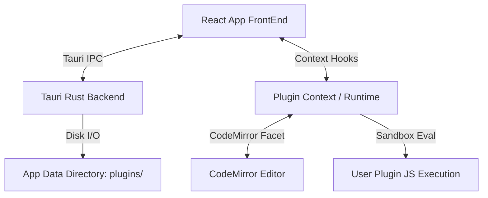

# ActOne Plugin System: Implementation Plan & API Reference

This document outlines the detailed architecture, implementation plan, and API reference for introducing a plugin system and library in **ActOne**.

---

## 1. Overview of Beat's Plugin Architecture vs. ActOne

Beat uses macOS native APIs (**JavaScriptCore** / `JSContext` / `JSExport` protocol) to run plugin scripts. In ActOne, since the application is built on top of **Tauri** (React + HTML5/JS frontend running inside a native Webview), we do not need to run an external Javascript engine on the Rust side. Instead, we can evaluate plugin scripts directly inside a sandboxed/isolated JavaScript context in the frontend, bridging frontend states (React contexts + CodeMirror 6) and native filesystem operations (Tauri Rust commands).

### Comparison of Runtimes

| Feature | Beat (macOS Native) | ActOne (Tauri + React + CodeMirror) |
| :--- | :--- | :--- |
| **Runtime Environment** | Native `JSContext` (JavaScriptCore) | Frontend Webview Context (`new Function` Sandbox / IFrame / Web Worker) |
| **API Exposure** | Objective-C `@protocol JSExport` bridge | JavaScript proxy object (`window.ActOne` or isolated scope parameter) |
| **Editor Integration** | Direct text/attribute manipulation of `NSTextStorage` | CodeMirror 6 transactions via dispatching editor view updates |
| **User Interface** | AppKit/UIKit Modals + WebKit-based floating panels | React dialog components / overlays + Tauri Webview Windows |
| **File Operations** | Native file coordinators / sandboxed filesystem wrappers | Tauri FS API & customized Rust background file commands |

---

## 2. System Architecture



### Sandbox Execution Strategy
To safely execute user scripts:
1. **Scope Isolation:** Wrap plugin code inside an IIFE or evaluate it with an explicit parameter mapping.
   ```javascript
   function executePlugin(scriptContent, actOneAPIInstance) {
     const run = new Function('ActOne', scriptContent);
     run(actOneAPIInstance);
   }
   ```
2. **Restricting Globals:** Filter/override critical browser globals (like `fetch`, `window.location`, `localStorage`) if security-hardening is needed in future versions.

---

## 3. ActOne Plugin API Reference

Below is the complete API reference exposed to user plugins under the global `ActOne` object.

### Debugging Console
* `ActOne.openConsole()`
* `ActOne.log(message)`

### Document & Screenplay Access
* `ActOne.getText()` — Returns the entire screenplay document as a string.
* `ActOne.lines()` — Returns an array of parsed Line objects.
* `ActOne.outline()` — Returns OutlineScene objects (including synopsis lines and sections).
* `ActOne.scenes()` — Returns only scene heading objects.
* `ActOne.linesForScene(scene)` — Returns all line objects belonging to the specified scene.
* `ActOne.currentLine` — Returns the Line object currently under the editor's cursor.
* `ActOne.setColorForScene(scene, color)` — Sets the outline scene background color tag.
* `ActOne.outlineAsJSON()` — Returns the outlined scenes formatted as a JSON string.
* `ActOne.scenesAsJSON()` — Returns only scene headings formatted as a JSON string.

#### Line Object Properties & Methods
Each Line object returned by `ActOne.lines()` contains:
* `.string` — The raw text string of the line.
* `.position` — Character start index in the document.
* `.textRange` — An object `{ location, length }` covering the line text.
* `.range` — An object `{ location, length }` covering the text and the line break.
* `.type` — Integer representing line type (matching internal `LineType` enum).
* `.typeAsString()` — Returns a string name (e.g., `"Action"`, `"Dialogue"`, `"Heading"`).
* `.isTitlePage()` — Returns `true` if the line belongs to the title page block.
* `.isOutlineElement()` — Returns `true` if the line defines outline structure.
* `.isInvisible()` — Returns `true` if the line is not visible in standard layouts.
* `.cleanedString()` — Returns string stripped of markdown formatting markup.
* `.stripFormatting()` — Returns string stripped of Fountain formatting tags.
* `.omitted` — Boolean indicating if scene/line is marked as omitted.
* `.note` — Returns the text content of any note tags `[[...]]` found on this line.
* `.clone()` — Returns a clone of the line object.
* `.forSerialization()` — Returns a serializable JSON representation of the line.

### Editor & Navigation Controls
* `ActOne.addString(string, index)` — Inserts a string at the specified character index.
* `ActOne.replaceRange(index, length, string)` — Replaces text in the range with the new string.
* `ActOne.selectedRange()` — Returns `{ location, length }` representing the current selection.
* `ActOne.setSelectedRange(location, length)` — Sets the text editor cursor or highlight selection range.
* `ActOne.scrollTo(index)` — Scrolls the editor view to target index.
* `ActOne.scrollToScene(scene)` — Scrolls the editor view to the beginning of the specified scene.
* `ActOne.scrollToLine(line)` — Scrolls the editor view to the specified line.
* `ActOne.focusEditor()` — Focuses cursor input back to the screenplay editor.

### Formatting & Highlighting
* `ActOne.reformat(line)` — Forces a parsing and indentation reformat on the specified line.
* `ActOne.reformatRange(location, length)` — Reformats all lines within the character range.
* `ActOne.textBackgroundHighlight(color, location, length)` — Applies background color highlighting to text range.
* `ActOne.textHighlight(color, location, length)` — Applies text foreground color highlighting to text range.

### Modal Windows & Prompts
* `ActOne.alert(title, info)` — Shows a modal alert window with message details.
* `ActOne.confirm(title, info)` — Shows a confirmation dialog with OK and Cancel options. Returns a boolean.
* `ActOne.prompt(title, info, placeholder)` — Opens a prompt window with a text entry field. Returns input string.
* `ActOne.dropdownPrompt(title, info, choices)` — Opens a dropdown selection window. Returns the selected choice string.
* `ActOne.modal(options, callback)` — Opens an advanced modal window. `options` is an object:
  ```javascript
  {
    title: "Character Details",
    info: "Input character description details",
    items: [
      { type: "text", name: "charName", label: "Name", placeholder: "e.g. Hero" },
      { type: "dropdown", name: "charRole", label: "Role", items: ["Protagonist", "Antagonist"] },
      { type: "space" },
      { type: "checkbox", name: "mainCast", label: "Main Cast Member" }
    ]
  }
  ```

### Settings & Document Properties
* `ActOne.getUserDefault(key)` — Retrieves an app-wide user preference setting.
* `ActOne.setUserDefault(key, value)` — Sets an app-wide user preference setting.
* `ActOne.getDocumentSetting(key)` — Retrieves a setting specific to this screenplay for the plugin.
* `ActOne.setDocumentSetting(key, value)` — Sets a setting specific to this screenplay for the plugin.
* `ActOne.setRawDocumentSetting(key, value)` — Overwrites a raw global document preference value.
* `ActOne.getRawDocumentSetting()` — Retrieves raw global document preference settings.

### Document Events & Background Listeners
Plugins can register hook callbacks:
* `ActOne.onTextChange(callback(location, length))` — Fires on editor text modifications.
* `ActOne.onOutlineChange(callback(...outline))` — Fires when outline elements are recalculated.
* `ActOne.onSceneIndexUpdate(callback(sceneIndex))` — Fires when active focus enters a new scene.
* `ActOne.onDocumentSave(callback())` — Fires when the document is written to disk.
* `ActOne.onTextChangeDisabled` — Boolean. Disable text listener callbacks to prevent loops.
* `ActOne.onOutlineChangeDisabled` — Boolean. Disable outline listener callbacks.
* `ActOne.onSelectionChangeDisabled` — Boolean. Disable cursor selection listener callbacks.
* `ActOne.onSceneIndexChangeDisabled` — Boolean. Disable scene transition listener callbacks.

### HTML panels & Custom Views
* `ActOne.htmlPanel(htmlContent, width, height, callback, okButton)` — Modal HTML dialogue.
* `ActOne.htmlWindow(htmlContent, width, height, callback)` — Opens a standalone HTML window, returning an `htmlWindow` object:
  * `.title` — Get title of window.
  * `.setTitle(string)` — Set title of window.
  * `.setHTML(htmlString)` — Load new HTML content.
  * `.close()` — Close the window.
  * `.setFrame(x, y, width, height)` — Set position and size.
  * `.getFrame()` — Returns `{ x, y, width, height }`.
  * `.screenSize()` — Returns screen bounds array `[width, height]`.
  * `.runJS(javascriptString)` — Evaluates JavaScript code inside the panel webview.

### Filesystem Operations
* `ActOne.openFile(extensions, callback)` — Opens file selection dialog for extensions. Returns file path to callback.
* `ActOne.openFiles(extensions, callback)` — Opens selection dialog allowing multiple files. Returns array of paths.
* `ActOne.fileToString(path)` — Reads text content of target file.
* `ActOne.pdfToString(path)` — Extracts text string from a PDF document.
* `ActOne.saveFile(extension, callback)` — Opens save-file location dialog. Returns path.
* `ActOne.writeToFile(path, content)` — Writes text content string to path.

### Timers & Asynchronous execution
* `ActOne.timer(seconds, callback, repeat)` — Runs callback after timeout. Returns a timer instance with:
  * `.invalidate()` — Stops and disposes of the timer.
  * `.stop()` — Stops timer operations.
  * `.start()` — Starts/resumes timer operations.
  * `.running()` — Returns boolean indicating state.
* `ActOne.async(function)` — Runs target function in a background worker context.
* `ActOne.sync(function)` — Runs target function in main execution thread (UI operations).

---

## 4. Rust Backend Commands

We will introduce three Rust commands in `lib.rs` to handle filesystem operations for plugins:

```rust
use std::fs;
use std::path::PathBuf;
use serde::{Serialize, Deserialize};

#[derive(Serialize, Deserialize, Debug, Clone)]
pub struct PluginMetadata {
    pub name: String,
    pub description: Option<String>,
    pub author: Option<String>,
    pub version: Option<String>,
    pub plugin_type: Option<String>,
    pub filename: String,
}

#[tauri::command]
fn list_plugins(app_handle: tauri::AppHandle) -> Result<Vec<PluginMetadata>, String> {
    let mut plugins_dir = app_handle.path().app_data_dir().map_err(|e| e.to_string())?;
    plugins_dir.push("plugins");
    
    if !plugins_dir.exists() {
        fs::create_dir_all(&plugins_dir).map_err(|e| e.to_string())?;
        return Ok(vec![]);
    }
    
    let mut list = Vec::new();
    for entry in fs::read_dir(plugins_dir).map_err(|e| e.to_string())? {
        let entry = entry.map_err(|e| e.to_string())?;
        let path = entry.path();
        if path.is_file() && path.extension().map_or(false, |ext| ext == "js" || ext == "beatPlugin") {
            let content = fs::read_to_string(&path).map_err(|e| e.to_string())?;
            let filename = path.file_name().unwrap().to_string_lossy().to_string();
            let metadata = parse_plugin_headers(&content, filename);
            list.push(metadata);
        }
    }
    Ok(list)
}

fn parse_plugin_headers(content: &str, filename: String) -> PluginMetadata {
    let mut name = filename.replace(".beatPlugin", "").replace(".js", "");
    let mut description = None;
    let mut author = None;
    let mut version = None;
    let mut plugin_type = None;

    for line in content.lines() {
        let trimmed = line.trim();
        if trimmed.starts_with('*') || trimmed.starts_with("//") {
            let clean = trimmed.trim_start_matches('*').trim_start_matches("//").trim();
            if let Some(colon_idx) = clean.find(':') {
                let key = clean[..colon_idx].trim().to_lowercase();
                let value = clean[colon_idx + 1..].trim().to_string();
                match key.as_str() {
                    "name" | "plugin name" => name = value,
                    "description" => description = Some(value),
                    "author" | "copyright" => author = Some(value),
                    "version" => version = Some(value),
                    "plugin type" | "type" => plugin_type = Some(value),
                    _ => {}
                }
            }
        }
    }

    PluginMetadata {
        name,
        description,
        author,
        version,
        plugin_type,
        filename,
    }
}

#[tauri::command]
fn upload_plugin(app_handle: tauri::AppHandle) -> Result<Option<PluginMetadata>, String> {
    let file = rfd::FileDialog::new()
        .add_filter("JavaScript Plugin", &["js", "beatPlugin"])
        .pick_file();
        
    let src_path = match file {
        Some(p) => p,
        None => return Ok(None)
    };

    let mut dest_dir = app_handle.path().app_data_dir().map_err(|e| e.to_string())?;
    dest_dir.push("plugins");
    
    if !dest_dir.exists() {
        fs::create_dir_all(&dest_dir).map_err(|e| e.to_string())?;
    }

    let filename = src_path.file_name().unwrap().to_string_lossy().to_string();
    let mut dest_path = dest_dir.clone();
    dest_path.push(&filename);

    fs::copy(&src_path, &dest_path).map_err(|e| e.to_string())?;
    
    let content = fs::read_to_string(&dest_path).map_err(|e| e.to_string())?;
    let metadata = parse_plugin_headers(&content, filename);
    
    Ok(Some(metadata))
}

#[tauri::command]
fn open_plugins_folder(app_handle: tauri::AppHandle) -> Result<(), String> {
    let mut plugins_dir = app_handle.path().app_data_dir().map_err(|e| e.to_string())?;
    plugins_dir.push("plugins");
    
    if !plugins_dir.exists() {
        fs::create_dir_all(&plugins_dir).map_err(|e| e.to_string())?;
    }
    
    #[cfg(target_os = "windows")]
    std::process::Command::new("explorer").arg(plugins_dir).spawn().ok();
    
    #[cfg(target_os = "macos")]
    std::process::Command::new("open").arg(plugins_dir).spawn().ok();
    
    #[cfg(target_os = "linux")]
    std::process::Command::new("xdg-open").arg(plugins_dir).spawn().ok();
    
    Ok(())
}
```

---

## 5. UI Design: The Plugin Library Modal

The modal interface will follow the layout shown in the reference design, adapted to ActOne's modern styling tokens:

```
+-----------------------------------------------------------------------+
|  Plugin Library                                                   [X] |
+------------------------------------+----------------------------------+
|  [ ] Character Connections         |                                  |
|  [x] Cherry-Pick Scenes            |          Plugin Library          |
|  [ ] Daily Script                  |                                  |
|  [x] Floating Notepad              |   A library of user-uploaded     |
|                                    |   plugins. Checked plugins will  |
|                                    |   be registered inside the       |
|                                    |   Command Palette for quick      |
|                                    |   access.                        |
|                                    |                                  |
|                                    |   [Upload Plugin] Button         |
+------------------------------------+----------------------------------+
|  [FolderIcon]                      |                                  |
+------------------------------------+----------------------------------+
```

---

## 6. Key Architectural Suggestions & Gotchas

To ensure robustness, security, and stability in production, the following design recommendations should be incorporated during implementation:

### 1. Security Sandboxing via Isolated Iframes
Because Tauri applications bridge web technologies with local operating system permissions, running raw user-uploaded script files in the root window is a high-risk security hazard.
* **Mechanism:** Load and evaluate user scripts inside a hidden `<iframe>` with strict sandbox settings:
  ```html
  <iframe sandbox="allow-scripts" src="about:blank"></iframe>
  ```
* **Bridge Communication:** The main thread will instantiate the iframe, inject/provide the sandbox-safe `ActOne` API shell, and utilize standard HTML `window.postMessage()` channels to validate, control, and execute updates triggered by the plugin.

### 2. Recursive Update Loop Safeguards
Plugins registering to update notifications (like `ActOne.onTextChange`) that concurrently modify text (via `ActOne.replaceRange`) can trigger recursive call loops, freezing the application.
* **Mechanism:** Tag all transactions dispatched from the plugin context with a dedicated CodeMirror `StateEffect` transaction tag:
  ```typescript
  import { StateEffect } from "@codemirror/state";
  export const pluginTransactionEffect = StateEffect.define<boolean>();
  ```
* **Filter Strategy:** In the CodeMirror text update listener, verify the incoming transaction. If it contains the `pluginTransactionEffect` tag, immediately bypass firing the user `onTextChange` hook to prevent recursion.

### 3. Cleanup Registry for Resident Plugins
Active background listeners, asynchronous timers, or unclosed HTML panel windows spawned by a plugin will leak memory if the plugin is disabled or the document changes.
* **Mechanism:** Maintain an active registry object for each initialized plugin.
* **Disposal:** When a plugin is disabled (unchecked in UI) or a screenplay tab is closed, automatically trigger a teardown sequence:
  * Invalidate all running timers in the registry.
  * Revoke any registered document lifecycle handlers.
  * Programmatically close and destroy any open `WebviewWindow` child panels.

---

## 7. Implementation Steps

### Phase 1: Rust Commands Integration
* Create the target directory `$APP_DATA/plugins` automatically upon system boot.
* Implement `list_plugins`, `upload_plugin`, and `open_plugins_folder` inside `src-tauri/src/lib.rs`.
* Register the commands in the `invoke_handler` array.

### Phase 2: Frontend JS Bridge & Sandbox Execution
* Create a context file `src/context/PluginContext.tsx`.
* Implement the execution function that compiles the plugin script inside a safe JS sandbox using `new Function()`.
* Map React functions (`setRawText`, `editorView.dispatch`, etc.) to the properties of the injected `ActOne` object.
* Store the list of enabled plugin filenames in the app settings file so that resident plugins run automatically on startup.

### Phase 3: Plugin UI Library Screen
* Build the `PluginsLibraryModal.tsx` React component.
* Integrate the modal with `ModalManager.tsx` and map a toggle action under `AppInner` and the Command Palette.
* Hook up the "Upload Plugin" button and list checkbox handlers to backend invoke calls.

### Phase 4: Plugin Execution Hooks
* Connect plugin listeners (`onTextChange`, `onOutlineChange`) to React's editor change hooks.
* Populate the command palette with active "Tool"-type plugins, allowing users to invoke them on command.
